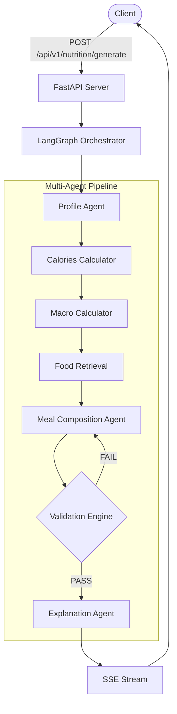

# 🥗 Nutrition AI Multi-Agent System

> **Version:** 1.0.0 | **Stack:** FastAPI · LangGraph · React · Vite · Groq · LangSmith · Pandas

A personalized nutrition planning service powered by a **7-node Multi-Agent LangGraph pipeline**. The system generates scientifically validated daily meal plans tailored to individual profiles, with a special focus on Egyptian cuisine. It provides real-time streaming updates of the AI's thought process and detailed explanations for its dietary choices.

---

## ✨ Key Features

- **Multi-Agent Orchestration**: Utilizes LangGraph to coordinate multiple specialized AI agents (Profile, Meal Composition, Explanation).
- **Scientific Validation**: Built-in calculators for BMR, TDEE, and macros ensure all dietary recommendations are mathematically sound.
- **Real-time Streaming**: Uses Server-Sent Events (SSE) to stream the AI's progress and thought process directly to the client.
- **Modern Web Interface**: A sleek React/Vite frontend for users to input their data and visualize their personalized meal plans.
- **Explainable AI**: An independent Explanation Agent validates the meal plan and provides a transparent rationale for the generated diet.

---

## 🏗️ Architecture



*The pipeline allows for up to 3 retries during the Validation phase if the generated meal plan does not meet the scientific constraints.*

---

## 🚀 Quick Start

### Prerequisites
- Python 3.10+
- Node.js 18+ (for Frontend)
- API Keys for Groq and LangChain (optional, for LangSmith tracing)

### 1. Backend Setup

```bash
# Create & activate virtual environment
python -m venv .venv
# Windows: .venv\Scripts\activate
# Linux/Mac: source .venv/bin/activate

# Install dependencies
pip install -r requirements.txt

# Configure environment variables
cp .env.example .env
# Edit .env to add your GROQ_API_KEY and LANGCHAIN_API_KEY

# Run the FastAPI server
uvicorn app.main:app --reload --host 0.0.0.0 --port 8000
```
*Backend Swagger UI will be available at: http://localhost:8000/docs*

### 2. Frontend Setup

```bash
# Open a new terminal and navigate to the frontend directory
cd frontend

# Install Node dependencies
npm install

# Start the React development server
npm run dev
```
*The frontend will typically run at: http://localhost:5173*

---

## 🐳 Docker Setup

If you prefer to run the entire stack using Docker:

```bash
# Copy the environment file and fill in your API keys
cp .env.example .env

# Build and start the containers
docker compose up --build
```

---

## 📡 API Endpoints

| Method | Endpoint | Description |
|--------|----------|-------------|
| `POST` | `/api/v1/nutrition/generate` | Start meal plan generation |
| `GET` | `/api/v1/nutrition/stream/{run_id}` | SSE stream of agent events |
| `GET` | `/api/v1/nutrition/result/{run_id}` | Retrieve final meal plan |
| `GET` | `/api/v1/nutrition/history` | List all past plans |
| `DELETE` | `/api/v1/nutrition/{run_id}` | Delete a result |
| `GET` | `/health` | Health check |

---

## 📁 Project Structure

```text
.
├── app/                       # Backend Application
│   ├── agents/                # LLM agents (Profile, Meal Composition, Explanation)
│   ├── api/                   # FastAPI routes
│   ├── calculators/           # Deterministic BMR/TDEE/macro calculators
│   ├── core/                  # Config, constants, logging
│   ├── graph/                 # LangGraph nodes, routing, builder
│   ├── retrieval/             # Pandas food retrieval layer
│   ├── schemas/               # Pydantic models (request, response, foods)
│   ├── services/              # Nutrition & Streaming Services
│   └── validation/            # Deterministic validation engine
├── frontend/                  # React + Vite UI
├── tests/                     # Pytest suite
├── DataPrep/                  # Food dataset and preparation scripts
└── docs/                      # Extensive project documentation
```

---

## 🧪 Testing

To run the backend tests:

```bash
# Ensure your virtual environment is active
pytest tests/ -v
```

---

## 📈 LangSmith Monitoring

To trace and monitor the agent decisions, ensure the following are set in your `.env` file:

```ini
LANGCHAIN_TRACING_V2=true
LANGCHAIN_API_KEY=your_key
LANGCHAIN_PROJECT=NutritionAgent
```
All agent calls (Profile, Meal Composition, Explanation) will automatically be traced in [LangSmith](https://smith.langchain.com).
