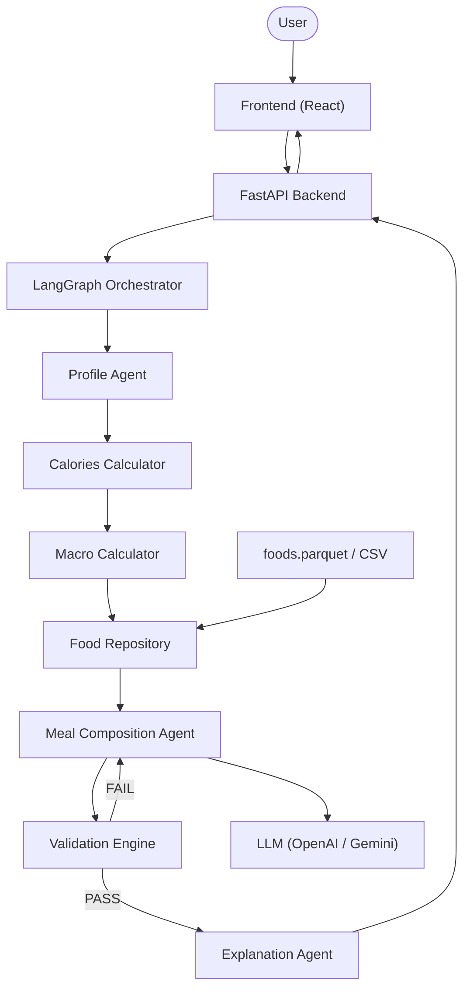

# System Architecture

```mermaid
flowchart TB

    User([User])

    FE["Frontend (React)"]

    API["FastAPI Backend"]

    Graph["LangGraph Orchestrator"]

    Profile["Profile Agent"]

    Calories["Calories Calculator"]

    Macro["Macro Calculator"]

    Repository["Food Repository"]

    Planner["Meal Composition Agent"]

    Validation["Validation Engine"]

    Explanation["Explanation Agent"]

    Dataset["foods.parquet / CSV"]

    LLM["LLM (OpenAI / Gemini)"]

    User --> FE

    FE --> API

    API --> Graph

    Graph --> Profile

    Profile --> Calories

    Calories --> Macro

    Macro --> Repository

    Dataset --> Repository

    Repository --> Planner

    Planner --> LLM

    Planner --> Validation

    Validation -->|PASS| Explanation

    Validation -->|FAIL| Planner

    Explanation --> API

    API --> FE

```