# LangGraph Workflow

```mermaid
flowchart LR

START((START))

Profile["Profile Agent"]

Calories["Calories Calculator"]

Macro["Macro Calculator"]

Repository["Food Repository"]

Planner["Meal Composition Agent"]

Validation["Validation Engine"]

Explanation["Explanation Agent"]

END((END))

START --> Profile

Profile --> Calories

Calories --> Macro

Macro --> Repository

Repository --> Planner

Planner --> Validation

Validation -- PASS --> Explanation

Validation -- FAIL --> Planner

Explanation --> END

```



---

## Node Types

| Component | Type |
|-----------|------|
| Profile Agent | LLM Node |
| Calories Calculator | Tool Node |
| Macro Calculator | Tool Node |
| Food Repository | Tool Node |
| Meal Composition Agent | LLM Node |
| Validation Engine | Tool Node |
| Explanation Agent | LLM Node |

---

## Graph Flow

```
START

↓

Profile Agent

↓

Calories Calculator

↓

Macro Calculator

↓

Food Repository

↓

Meal Composition Agent

↓

Validation Engine

↓

PASS ?

├── YES → Explanation Agent → END

└── NO → Meal Composition Agent (Retry)

```

---

## Retry Policy

```
Validation Failed

↓

Retry Meal Composition

↓

Maximum Retries = 3

↓

Still Fail?

↓

Return Best Candidate + Validation Report

```

---

## Streaming Events

Each node emits:

```
STARTED

↓

PROCESSING

↓

COMPLETED
```

or

```
STARTED

↓

FAILED
```

These events are streamed to the frontend using Server-Sent Events (SSE).
