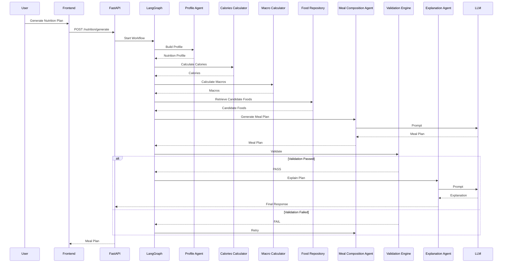

# Nutrition Generation Sequence

```mermaid
sequenceDiagram

participant U as User

participant FE as Frontend

participant API as FastAPI

participant G as LangGraph

participant P as Profile Agent

participant C as Calories Calculator

participant M as Macro Calculator

participant R as Food Repository

participant A as Meal Composition Agent

participant V as Validation Engine

participant E as Explanation Agent

participant L as LLM

U->>FE: Generate Nutrition Plan

FE->>API: POST /nutrition/generate

API->>G: Start Workflow

G->>P: Build Profile

P-->>G: Nutrition Profile

G->>C: Calculate Calories

C-->>G: Calories

G->>M: Calculate Macros

M-->>G: Macros

G->>R: Retrieve Candidate Foods

R-->>G: Candidate Foods

G->>A: Generate Meal Plan

A->>L: Prompt

L-->>A: Meal Plan

A-->>G: Meal Plan

G->>V: Validate

alt Validation Passed

    V-->>G: PASS

    G->>E: Explain Plan

    E->>L: Prompt

    L-->>E: Explanation

    E-->>API: Final Response

else Validation Failed

    V-->>G: FAIL

    G->>A: Retry

end

API-->>FE: Meal Plan

```
