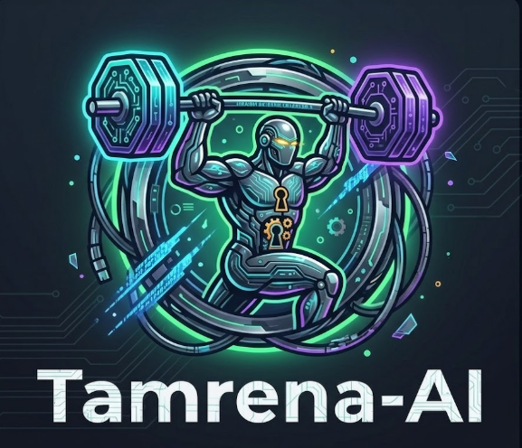

# Tamrena-AI — Full Platform Monorepo



**Tamrena-AI** is a comprehensive, multi-agent AI platform providing personalized workout prescription, nutrition planning, and real-time computer vision pose tracking for exercise form analysis.

---

## 🏗️ System Architecture & Service Topology

The platform is structured as a microservices monorepo orchestrated via Docker Compose:

```
                          ┌───────────────────────┐
                          │     web-frontend      │
                          │   (React + Vite UI)   │
                          │     Port: 5174        │
                          └───────────┬───────────┘
                                      │
                                      ▼
                          ┌───────────────────────┐
                          │      web-backend      │
                          │    (FastAPI BFF)      │
                          │     Port: 8010        │
                          └───────────┬───────────┘
                                      │
          ┌───────────────────────────┼───────────────────────────┐
          │                           │                           │
          ▼                           ▼                           ▼
┌───────────────────┐       ┌───────────────────┐       ┌───────────────────┐
│  tamrena-workout  │       │   nutrition-api   │       │    cv-backend     │
│  (Workout AI RAG) │       │  (Nutrition AI)   │       │(Pose Tracking CV) │
│    Port: 8001     │       │    Port: 8000     │       │    Port: 8002     │
└─────────┬─────────┘       └─────────┬─────────┘       └─────────┬─────────┘
          │                           │                           │
          └───────────────────────────┼───────────────────────────┘
                                      │
                                      ▼
                          ┌───────────────────────┐
                          │    mongodb (Database) │
                          │     Port: 27017       │
                          └───────────────────────┘
```

---

## 🛠️ Microservices Included

| Service | Directory | Tech Stack | Port | Description |
| :--- | :--- | :--- | :--- | :--- |
| **Website Frontend** | `./tamreena-web/frontend` | React, Vite, TypeScript, Tailwind | `5174` | Unified platform web interface |
| **Web BFF Backend** | `./tamreena-web/backend` | FastAPI, Python | `8010` | Aggregates microservices & manages auth |
| **Workout AI** | `./Tamrena-Workout` | LangChain, LangGraph, RAG | `8001` | Multi-agent workout plan recommendation |
| **Nutrition AI** | `./Nutrition-Plan-Generation` | Python, Gemini, Groq, Pandas | `8000` | Automated meal composition & macros |
| **Computer Vision** | `./Computer-Vision` | OpenCV, MediaPipe, Python | `8002` | Live & uploaded video pose tracking |
| **Database** | Docker Image | MongoDB 6.0 | `27017` | Persistent application data store |

---

## 🚀 Getting Started & Local Setup

Follow these steps to pull and run the full system on a new machine:

### 1. Prerequisites
- [Docker Desktop](https://www.docker.com/products/docker-desktop/) (with Docker Compose v2+)
- Git installed

### 2. Clone the Repository
```bash
git clone https://github.com/AJXShadow/Tamrena-AI.git
cd Tamrena-AI
```

### 3. Environment Configuration
Copy the provided `.env.example` template files into `.env` at the root level and inside each service directory:

```bash
# Root environment file
cp .env.example .env

# Service-specific environment files
cp Tamrena-Workout/.env.example Tamrena-Workout/.env
cp Nutrition-Plan-Generation/.env.example Nutrition-Plan-Generation/.env
cp Computer-Vision/backend/.env.example Computer-Vision/.env
cp tamreena-web/.env.example tamreena-web/.env
```

Open `.env` and fill in your API keys (e.g., `GEMINI_API_KEY`, `OPENAI_API_KEY`, `ANTHROPIC_API_KEY`, `JWT_SECRET`).

---

### 4. Start the Application Stack
Run the entire platform with a single command:

```bash
docker-compose up --build
```

Docker Compose will build all 5 containers and connect them to MongoDB. Once complete, access:
* **Web UI**: [http://localhost:5174](http://localhost:5174)
* **BFF API Documentation**: [http://localhost:8010/docs](http://localhost:8010/docs)
* **Workout AI API Docs**: [http://localhost:8001/docs](http://localhost:8001/docs)
* **Nutrition AI API Docs**: [http://localhost:8000/docs](http://localhost:8000/docs)

---

## 📄 License & Contact
Developed as part of the Tamrena AI Platform.
